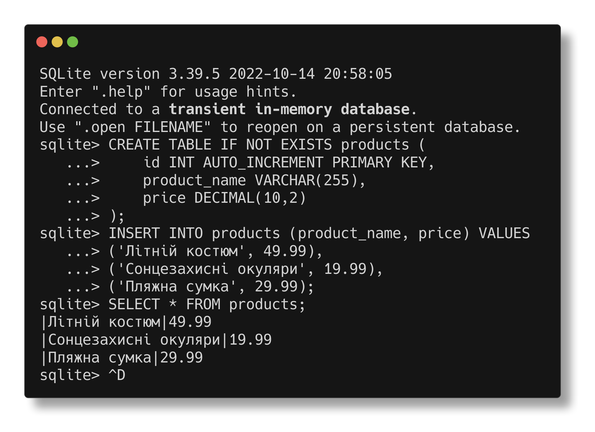

Солтисюк Дмитро, студент ТУ-12-21-ІПЗ

= Лабораторна робота №1

*Тема:* Введення в практику РСУБД.

*Мета:* Написати скрипт для пакетного створення бази даних, що складається з однієї таблиці з двома полями (ціле і текстове), введення в таблицю декількох записів і виконання оператора вибірки.

== Виконання

[start={list-counter}]
{counter:list-counter}. Створення бази даних та таблиці:
[source,sql]
----
CREATE TABLE IF NOT EXISTS products (
    id INT AUTO_INCREMENT PRIMARY KEY,
    product_name VARCHAR(255),
    price DECIMAL(10,2)
);
----

{counter:list-counter}. Вставка декількох записів в таблицю:
[source,sql]
----
INSERT INTO products (product_name, price) VALUES
('Літній костюм', 49.99),
('Сонцезахисні окуляри', 19.99),
('Пляжна сумка', 29.99);
----

{counter:list-counter}. Виконання оператора вибірки:
[source,sql]
----
SELECT * FROM products;
----

== Висновок

У результаті виконання лабораторної роботи було успішно створено базу даних "online_store" для зберігання інформації про товари в інтернет-магазині. Таблиця "products" містить інформацію про продукти, включаючи їхні назви та ціни. Декілька записів було вставлено у таблицю, а також було виконано запит для вибірки всіх записів для перевірки коректності вставки. Усі етапи виконано вірно та без помилок.
