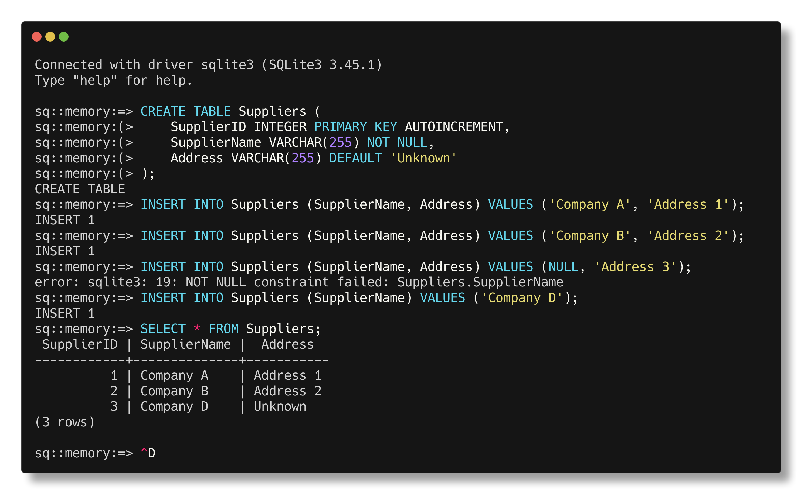

Солтисюк Дмитро, студент ТУ-12-21-ІПЗ

= Лабораторна робота №3: ОПЕРАТОР INSERT

Тема:: Оператор `INSERT`, ключове слово `NULL` і обмеження цілісності.

Мета:: Виконати різні форми оператора `INSERT`, додаючи записи в схему бази даних Постачальників з використанням різних обмежень цілісності: `AUTOINCREMENT`, `NOT NULL` і `DEFAULT XXX`.

== Виконання

=== Створення таблиці

[source,sql]
----
CREATE TABLE Suppliers (
    SupplierID INTEGER PRIMARY KEY AUTOINCREMENT,
    SupplierName VARCHAR(255) NOT NULL,
    Address VARCHAR(255) DEFAULT 'Unknown'
);
----

=== Оператор `INSERT` з обмеженням цілісності `AUTOINCREMENT`

[source,sql]
----
INSERT INTO Suppliers (SupplierName, Address) VALUES ('Company A', 'Address 1');
INSERT INTO Suppliers (SupplierName, Address) VALUES ('Company B', 'Address 2');
----

=== Оператор `INSERT` з обмеженням цілісності `NOT NULL`

[source,sql]
----
INSERT INTO Suppliers (SupplierName, Address) VALUES (NULL, 'Address 3');
----
Дана команда повинна видати помилку, про нецілісність даних - імʼя не повинно бути порожнім.

=== Оператор `INSERT` з обмеженням цілісності `DEFAULT XXX`

[source,sql]
----
INSERT INTO Suppliers (SupplierName) VALUES ('Company D');
----
По результатам даної команди значення "Address" буде задано за замовчуванням.

== Висновок

У цій лабораторній роботі ми виконали різні форми оператора `INSERT` в базу даних Постачальників, застосовуючи різні обмеження цілісності: `AUTOINCREMENT`, `NOT NULL` і `DEFAULT XXX`. Такі обмеження дозволяють забезпечити правильність та цілісність даних в базі даних.
