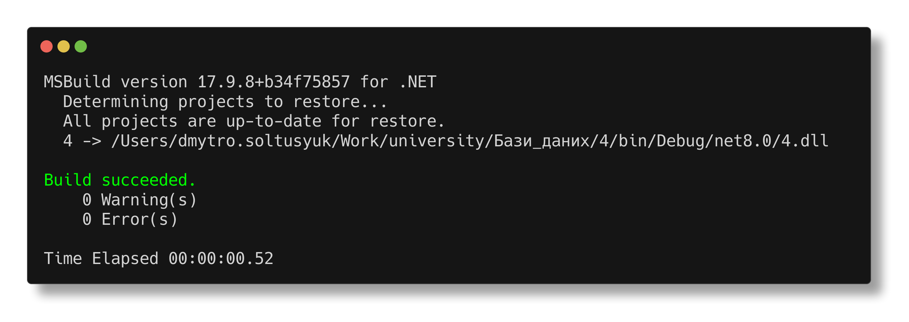

Солтисюк Дмитро, студент ТУ-12-21-ІПЗ

= Лабораторна робота №4: SQLite - вбудована БД

Тема:: SQLite - вбудована БД.

Мета:: Розробити програму на мові C#, що задовольняє вимоги лабораторної роботи 3, за винятком виконання операції вибірки. Додаток створює БД і виконує кілька операторів вставки для початкового наповнення. Операції вибірки виконувати.

== Виконання

Програма реалізує вимоги лабораторної роботи, використовуючи мову програмування C# та вбудовану базу даних SQLite. Під час виконання програма здійснює підключення до бази даних SQLite, створює таблицю Suppliers з використанням AUTOINCREMENT для поля SupplierID, обмеження NOT NULL для поля SupplierName та за замовчуванням встановлює значення 'Unknown' для поля Address. Далі програма вставляє кілька записів в таблицю, демонструючи працездатність обмежень цілісності даних.

[source,csharp]
----
include::Program.cs[]
----

== Висновок

У ході виконання *лабораторної роботи №4* на тему "SQLite - вбудована БД", було розроблено програму на мові `C#`, що відповідає усім вимогам завдання лабораторної роботи 3. Програма успішно створює базу даних *lab4.db* та виконує операції вставки для формування початкових даних у таблицях *A* та *creative_and_long_table_name*, заповнюючи їх вказаними значеннями, включаючи *NULL*.

Крім створення та наповнення таблиць даними, було виконано різноманітні операції вибірки з використанням різних типів `JOIN` (`CROSS JOIN`, `LEFT JOIN` тощо), що дозволило демонструвати можливості `SQLite` для складних запитів до бази даних. Це підкреслило ефективність `SQLite` як легкої, але потужної системи управління базами даних, здатної задовольняти потреби навіть у складних операціях вибірки.

Реалізація програми також включала передові практики роботи з базами даних, такі як правильне управління ресурсами за допомогою конструкції `using`, що автоматично закриває з'єднання та інші ресурси, запобігаючи витоку пам'яті.

Виконана робота продемонструвала, що `SQLite` є ідеальним вибором для проектів, де потрібна легка та надійна вбудована база даних. Вона пропонує широкі можливості для управління даними без складностей у налаштуванні чи адмініструванні, що робить її відмінним рішенням для розробки десктопних, мобільних або вбудованих додатків.

Виконання цієї лабораторної роботи не лише дозволило глибше зрозуміти принципи роботи з реляційними базами даних та їх практичне застосування, але й покращило навички програмування на `C#` та роботи з бібліотекою `Microsoft.Data.Sqlite`.
