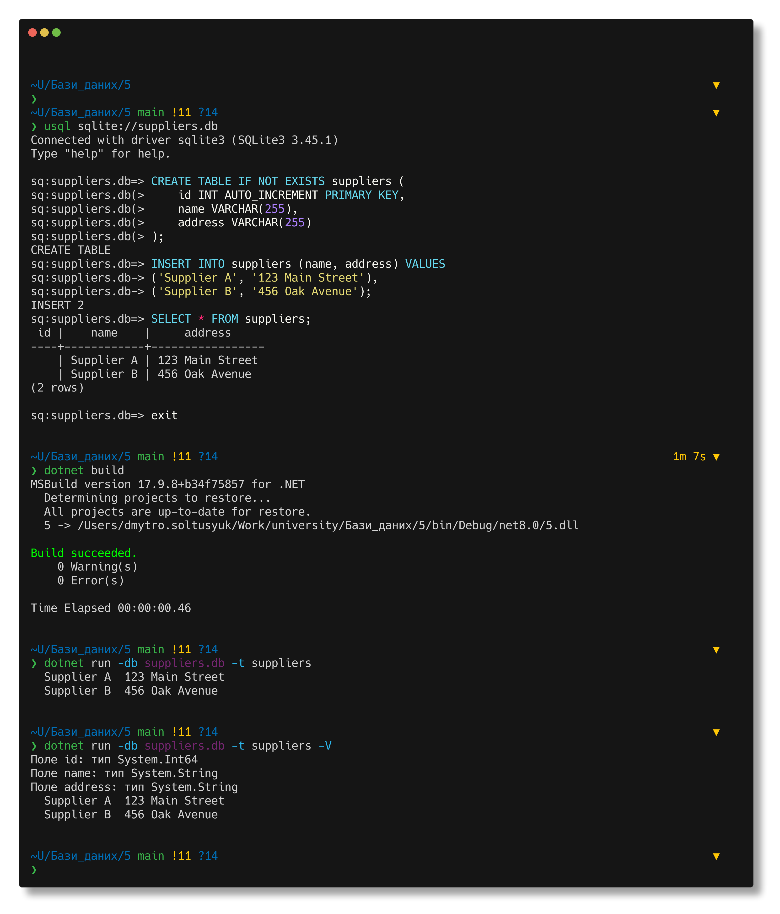

Солтисюк Дмитро, студент ТУ-12-21-ІПЗ

= Лабораторна робота №5: Експорт даних з таблиці

Тема:: Виконання операторів, які повертають безліч рядків.

Мета:: Розробити програму, яка для заданої бази даних витягує вміст заданої таблиці і, опціонально, надає довідкову інформацію по таблиці (заголовки і типи полів).

== Виконання

Програма написана на мові C# і використовує бібліотеку для роботи з SQLite базами даних. Вона приймає вхідні аргументи з командного рядка та витягує дані з вказаної таблиці в заданій базі даних. За необхідності програма може вивести інформацію про заголовки і типи полів таблиці. 

.Програма приймає наступні аргументи командного рядка:
* `-db file`: задає шлях до файлу бази даних.
* `-t tbl`: задає ім'я таблиці для експорту.
* `-v`: якщо вказаний, виводить імена і типи полів таблиці, загальну кількість витягнутих записів та час роботи програми.

[source,csharp]
----
include::Program.cs[]
----

== Висновок

У цій лабораторній роботі була розроблена програма на мові C#, яка дозволяє експортувати дані з таблиць SQLite бази даних. Програма задовольняє вимоги завдання та надає корисний функціонал для роботи з даними.
