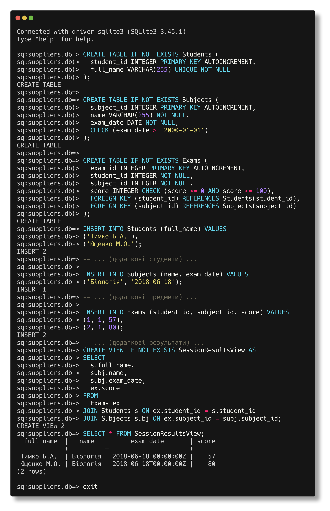

Солтисюк Дмитро, студент ТУ-12-21-ІПЗ

= Лабораторна робота №4.1

Тема:: База даних для складного імпорту.

Мета:: Розробити схему бази даних, що дозволяє здійснювати імпорт даних про результати сесії студентів.

== Виконання

[start={list-counter}]
{counter:list-counter}. **Створення бази даних**

Спершу, створимо файл бази даних SQLite. Задля цього використаємо програмну утиліту `usql` - програма, що дозволяє під'єднуватись до більшості популярних баз даних.

[source]
----
usql sqlite://suppliers.db
----
Результатом даної команди є створення нової бази даних або доступ до існуючої. Якщо база даних з вказаною назвою не існує, `usql` створить її автоматично, відкривши шлях для подальшого створення таблиць та управління даними.

[start={list-counter}]
{counter:list-counter}. **Створення таблиць**

[source,sql]
----
CREATE TABLE IF NOT EXISTS Students (
  student_id INTEGER PRIMARY KEY AUTOINCREMENT,
  full_name VARCHAR(255) UNIQUE NOT NULL
);

CREATE TABLE IF NOT EXISTS Subjects (
  subject_id INTEGER PRIMARY KEY AUTOINCREMENT,
  name VARCHAR(255) NOT NULL,
  exam_date DATE NOT NULL,
  CHECK (exam_date > '2000-01-01')
);

CREATE TABLE IF NOT EXISTS Exams (
  exam_id INTEGER PRIMARY KEY AUTOINCREMENT,
  student_id INTEGER NOT NULL,
  subject_id INTEGER NOT NULL,
  score INTEGER CHECK (score >= 0 AND score <= 100),
  FOREIGN KEY (student_id) REFERENCES Students(student_id),
  FOREIGN KEY (subject_id) REFERENCES Subjects(subject_id)
);
----
Тут ми створили схему БД для збереження даних в таблиці, створивши 3 таблиці: `Students`, `Subjects`, `Exams`. В схемі використали обмеження цілісності БД, використавши: `check`, `unique`. 
та `foreign key`.

[start={list-counter}]
{counter:list-counter}. **Додавання даних**

[source,sql]
----
INSERT INTO Students (full_name) VALUES
('Тимко Б.A.'),
('Ющенко М.О.');
-- ... (додаткові студенти) ...

INSERT INTO Subjects (name, exam_date) VALUES
('Біологія', '2018-06-18');
-- ... (додаткові предмети) ...

INSERT INTO Exams (student_id, subject_id, score) VALUES
(1, 1, 57),
(2, 1, 80);
-- ... (додаткові результати) ...
----

[start={list-counter}]
{counter:list-counter}. **Створення огляду (view)**

[source,sql]
----
CREATE VIEW IF NOT EXISTS SessionResultsView AS
SELECT 
  s.full_name,
  subj.name,
  subj.exam_date,
  ex.score
FROM 
  Exams ex
JOIN Students s ON ex.student_id = s.student_id
JOIN Subjects subj ON ex.subject_id = subj.subject_id;
----
На даному етапі ми використали операцію прямого поєднання таблиць `JOIN`, а також створили огляд (`VIEW`) - `SessionResultsView` для демонстрації результатів екзаменів з трьох таблиць.

[start={list-counter}]
{counter:list-counter}. **Запит для демонстрації результатів**

[source,sql]
----
SELECT * FROM SessionResultsView;
----

 

== Висновок

На даній лабораторній роботі було успішно створено структуру бази даних для збереження інформації про результати сесії студентів. Таблиці `Students`, `Subjects`, та `Exams` було налаштовано з дотриманням обмежень цілості даних, включаючи використання обмежень `CHECK`, `UNIQUE`, та `FOREIGN KEY`. Огляд `SessionResultsView` був створений для зручності відображення результатів. Всі необхідні дані були вставлені у таблиці, що дозволило виконати завдання лабораторної роботи, продемонструвавши роботу з операторами SQL та принципами розробки баз даних.
