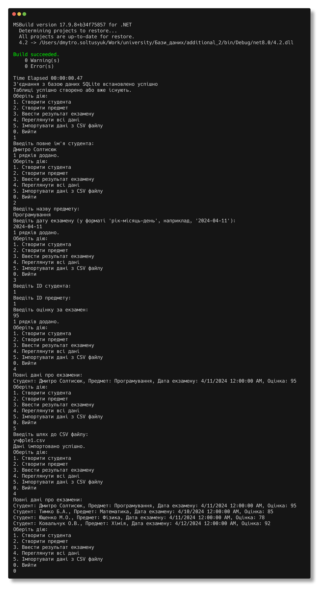

Солтисюк Дмитро, студент ТУ-12-21-ІПЗ

= Лабораторна робота №4.2

Тема:: Цілісність даних.

Мета:: Розробити програму для багатократного завантаження інформації про результати сесії у базу даних, створену в рамках лабораторної роботи 4.1.

== Вступ

Цей звіт описує програму "SessionResultsUploader", яка розроблена для багатократного завантаження інформації про результати сесії у базу даних SQLite. Програма дозволяє користувачу створювати студентів, предмети та вводити результати екзаменів.

== Функціонал програми

Програма "SessionResultsUploader" має такий функціонал:

- Створення студентів: користувач може ввести повне ім'я студента, і програма додає цього студента до бази даних.
- Створення предметів: користувач вводить назву предмету та дату екзамену, і програма додає цей предмет до бази даних.
- Введення результатів екзаменів: користувач може ввести ID студента, ID предмету та оцінку за екзамен, і програма додає цей результат до бази даних.
- Імпорт даних з CSV файлу: програма може імпортувати дані з CSV файлу, що містить інформацію про студентів, предмети та результати екзаменів.

== Процес розробки

Для розробки програми "SessionResultsUploader" були використані такі технології та інструменти:

- Мова програмування C#: програма розроблена мовою програмування C# з використанням технології .NET Core.
- База даних SQLite: для зберігання даних було використано легковагову базу даних SQLite.
- Бібліотека Microsoft.Data.Sqlite: для взаємодії з базою даних SQLite було використано бібліотеку Microsoft.Data.Sqlite.
- Консольний інтерфейс: програма має консольний інтерфейс користувача для взаємодії з програмою та введення даних.

== Додаткові особливості

Під час розробки програми "SessionResultsUploader" було приділено увагу таким аспектам:

- Обробка помилок: програма має механізм обробки помилок, який дозволяє коректно впоратися з непередбаченими ситуаціями та повідомляти користувача про помилки.
- Код якості: під час написання коду було дотримано принципів чистого коду та кращих практик програмування для забезпечення читабельності та підтримки програми у майбутньому.
- Тестування: програма була піддана тестуванню для перевірки правильності її роботи та виявлення можливих помилок.

== Огляд

[source,csharp]
----
include::Program.cs[]
----

== Висновок

Програма "SessionResultsUploader" є потужним інструментом для керування даними про результати сесії. Вона надає користувачам зручний спосіб створення та управління інформацією про студентів, предмети та результати екзаменів. Завдяки своїй простоті та функціональності, програма може бути використана в навчальних закладах та інших сферах, де потрібно ефективно керувати даними про успішність студентів.
