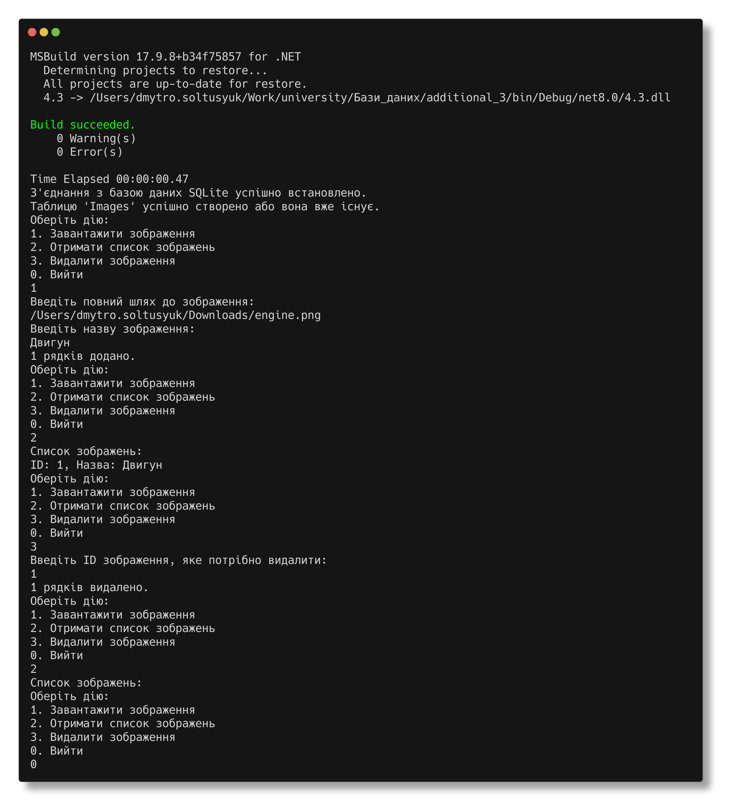

Солтисюк Дмитро, студент ТУ-12-21-ІПЗ

= Лабораторна робота №4.3

Тема:: Змінення вмісту БД.

Мета:: Розробити додаток для завантаження в БД заданої картинки, отримання списку картинок, вибору та видалення заданої.

== Огляд програми

Програма розроблена на мові програмування C# та використовує технологію бази даних SQLite для зберігання та обробки зображень. Консольний інтерфейс надає зручну взаємодію з користувачем.

== Функціонал програми

Програма має такий функціонал:

1. *Завантаження зображення*: Користувач може завантажити зображення в базу даних, вказавши повний шлях до файлу та назву зображення.
2. *Отримання списку зображень*: Користувач може переглянути список зображень, які знаходяться в базі даних, разом з їхніми унікальними ідентифікаторами.
3. *Видалення зображення*: Користувач може видалити зображення з бази даних, вказавши його унікальний ідентифікатор.

== Процес розробки

Для розробки програми було використано мову програмування C# та бібліотеку `Microsoft.Data.Sqlite` для роботи з базою даних SQLite. Програма створює з'єднання з базою даних, перевіряє наявність таблиці "Images" та створює її, якщо вона відсутня. Зображення зберігаються у форматі BLOB (Binary Large Object) прямо в базі даних.

Програма має модульну структуру, що дозволяє виконувати різні операції з базою даних у залежності від вибору користувача.

== Огляд програми
[source,csharp]
----
include::Program.cs[]
----

== Висновок

Розроблено консольний додаток для роботи з зображеннями у базі даних SQLite. Програма забезпечує користувача зручним та ефективним інтерфейсом для завантаження, перегляду та видалення зображень. Вона може бути використана в різноманітних сценаріях, де потрібно працювати з великим обсягом зображень та забезпечити їхню ефективну організацію та керування.
