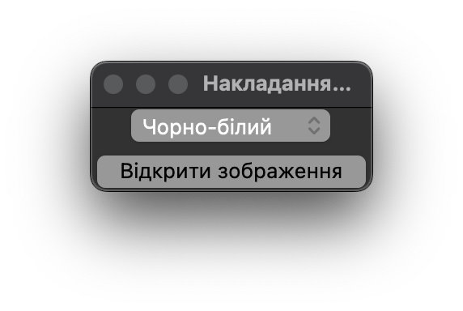
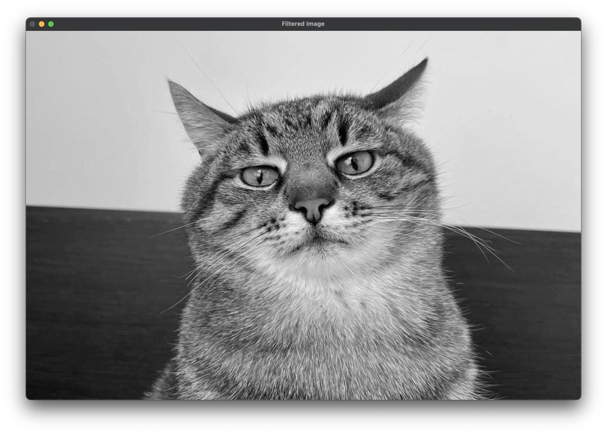
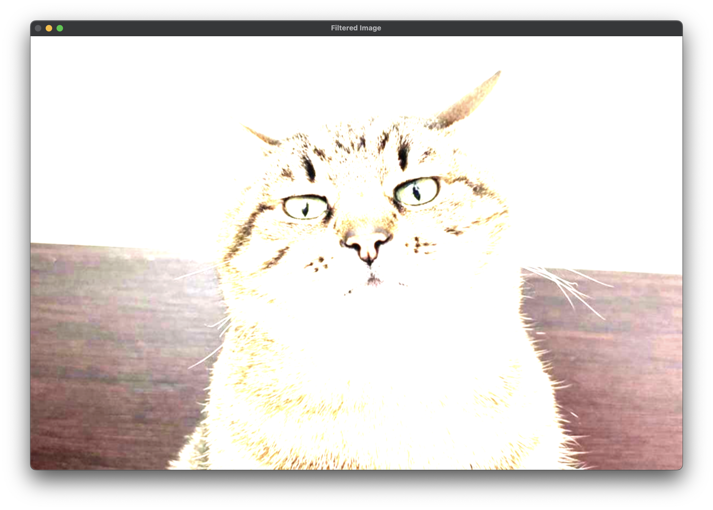
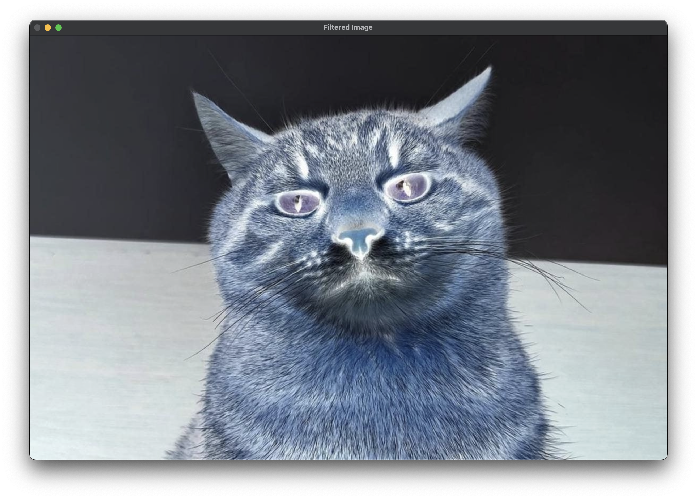

Солтисюк Дмитро, студент ТУ-12-21-ІПЗ.

= Звіт за практичну роботу №4. Фільтри

=== Опис завдання

У цій практичній роботі розроблено програмне забезпечення з графічним інтерфейсом для накладання різних фільтрів на зображення. Мінімум три фільтри було реалізовано.

=== Опис програмного забезпечення

Програма має наступний функціонал:
- Можливість завантаження будь-якого зображення з комп'ютера користувача.
- Вибір фільтрів з графічного інтерфейсу.
- Накладання обраних фільтрів на завантажене зображення.
- Збереження обробленого зображення на комп'ютер користувача.

=== Реалізовані фільтри

1. Фільтр "Чорно-білий": Конвертує зображення у чорно-білий варіант.
2. Фільтр "Сепія": Надає зображенню відтінок старовинного фотографічного паперу.
3. Фільтр "Негатив": Інвертує кольори зображення, створюючи ефект негативу.

=== Опис програмного забезпечення

Програма була розроблена з використанням мови програмування Python та бібліотеки Tkinter для створення графічного інтерфейсу.

[source, python]
----
include::main.py[]
----

Головний інтерфейс програми:

Фільтр "Чорно-білий":

Фільтр "Сепія":

Фільтр "Негатив":

=== Висновок

У результаті виконання цієї практичної роботи було розроблено програмне забезпечення для накладання різних фільтрів на зображення з графічним інтерфейсом. Реалізовано три різних фільтри, що дозволяє користувачеві легко змінювати вигляд зображення.
