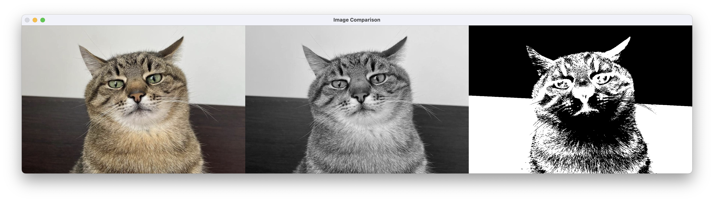

Солтисюк Дмитро, студент ТУ-12-21-ІПЗ.

= Звіт за практичну роботу №5. Сегментація зображення.

=== Опис завдання

Метою цієї практичної роботи було розробити програмне забезпечення, яке дозволяє накладати різні фільтри на зображення та виконувати сегментацію обраного зображення.

=== Опис алгоритму сегментації

Сегментація зображення - це процес розділення зображення на окремі частини або області, які представляють собою об'єкти або області інтересу. Це допомагає відокремити об'єкти на зображенні від тла або інших об'єктів.

Для виконання сегментації можна використовувати різні алгоритми, такі як порогова обробка, водоподіл, алгоритми кластеризації тощо. У нашому прикладі для простоти використаємо порогову обробку - розділення зображення на області на основі певного порогу яскравості.

=== Опис програмного забезпечення

.Програма має наступний функціонал:
* Можливість завантаження будь-якого зображення з комп'ютера користувача.
* Вибір фільтрів з графічного інтерфейсу.
* Накладання обраних фільтрів на завантажене зображення.
* Сегментація зображення на основі порогової обробки.
* Відображення оригінального зображення, зображення з накладеними фільтрами та сегментованого зображення.

Програма була розроблена з використанням мови програмування Python та бібліотеки Tkinter для створення графічного інтерфейсу. Для виконання сегментації зображення було використано бібліотеку OpenCV. 

У цьому коді додано функцію `segment_image`, яка використовує порогову обробку за допомогою методу Оцу для сегментації зображення. Після відкриття зображення та накладання фільтра програма також відображає сегментоване зображення.

[source, python]
----
include::main.py[]
----

Головний інтерфейс програми:

image::program_main.png[]

Фільтр "Чорно-білий":

Фільтр "Сепія":

Фільтр "Негатив":

=== Висновок

У результаті виконання цієї практичної роботи було успішно розроблено програмне забезпечення, яке дозволяє накладати різні фільтри на зображення та виконувати сегментацію зображення на основі порогової обробки. Використано засоби мови програмування Python та бібліотеки Tkinter та OpenCV.
