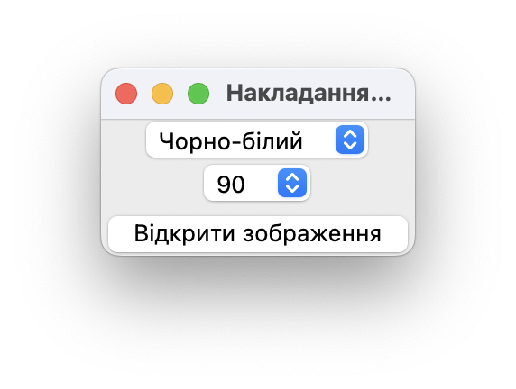
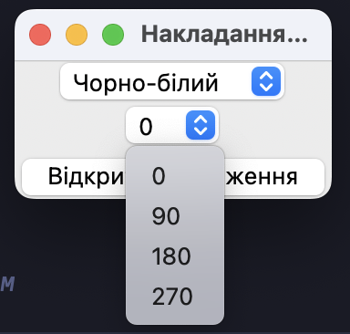

Солтисюк Дмитро, студент ТУ-12-21-ІПЗ.

= Звіт за практичну роботу №6. Двовимірне обертання зображення навколо осі.

=== Завдання

Метою практичної роботи було розширення функціональності програми, реалізованої у попередній практичній роботі, шляхом додавання можливості обертання зображення навколо осей `x` та `y`.

=== Виконання

1. Дослідження алгоритмів обертання: Перед початком роботи було вивчено різні алгоритми для обертання зображення навколо осей `x` та `y`. Були розглянуті математичні аспекти обертання та його вплив на зображення.
2. Розширення програмного забезпечення: На основі отриманих знань було розширено програмне забезпечення, додавши функціонал обертання зображення. Для цього використовувалася бібліотека OpenCV для обробки зображень.
3. Тестування та візуалізація: Після реалізації функціоналу обертання зображення було проведено тестування програми з різними зображеннями та кутами обертання. Результати тестування були візуалізовані для аналізу.

=== Результати

1. Успішно реалізовано функціонал обертання зображення навколо осей `x` та `y`.
2. Проведено тестування програми з різними зображеннями та кутами обертання.
3. Отримано результати візуалізації обернених зображень для аналізу.

Програма була розроблена з використанням мови програмування Python та бібліотеки Tkinter для створення графічного інтерфейсу. Для маніпуляції зображень було використано бібліотеку OpenCV. 

[source, python]
----
include::main.py[]
----

Головний інтерфейс програми:

Можливість обрати кут оберту:

Оберт 90 градусів:

Оберт 180 градусів:

=== Висновок

Виконання практичної роботи дозволило успішно розширити функціональність програмного забезпечення для обробки зображень. Додавання можливості обертання зображення навколо осей `x` та `y` робить програму більш універсальною та корисною для використання. В результаті роботи були отримані нові навички у роботі з обробкою зображень та застосуванні алгоритмів обертання.
